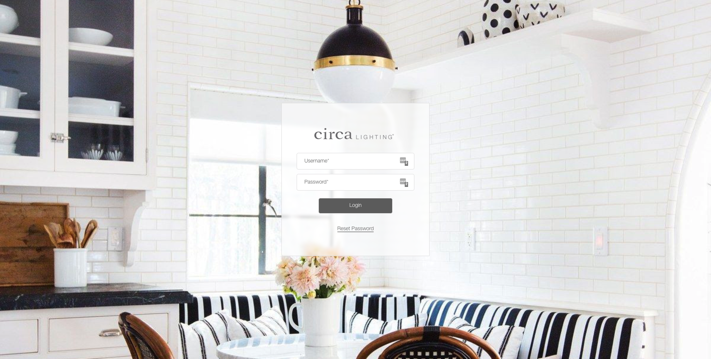
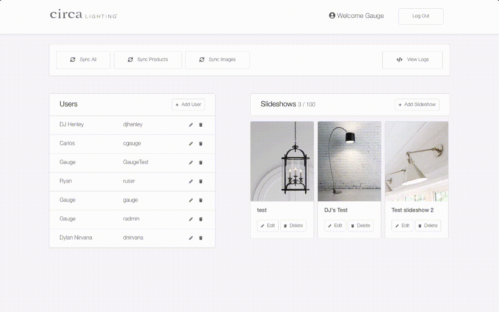
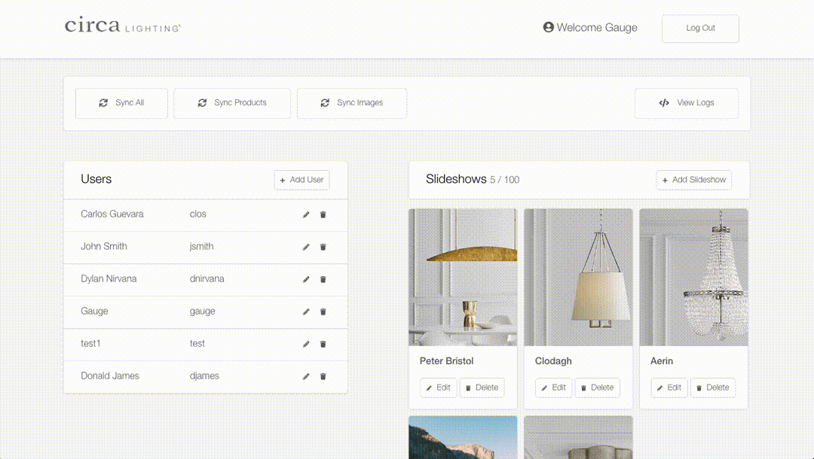
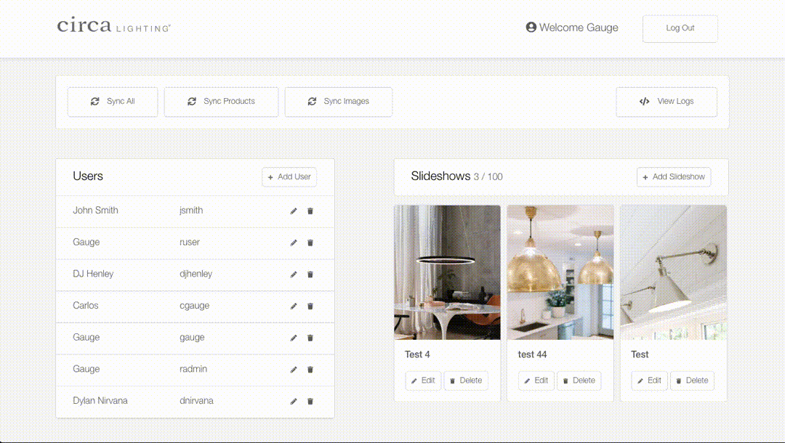
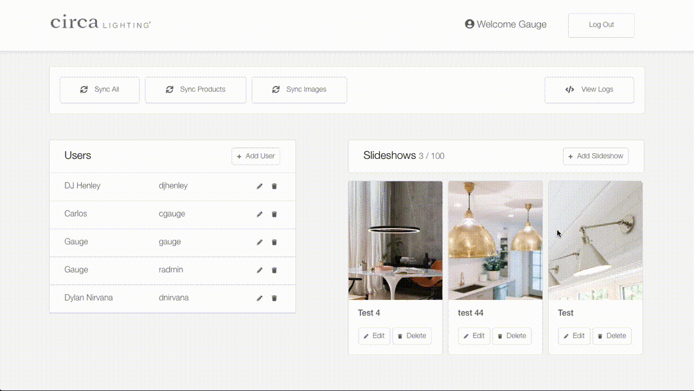
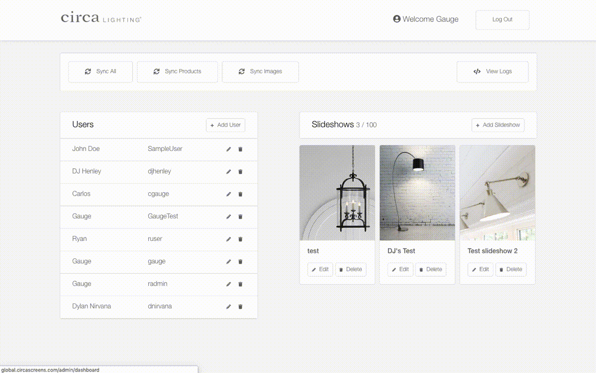
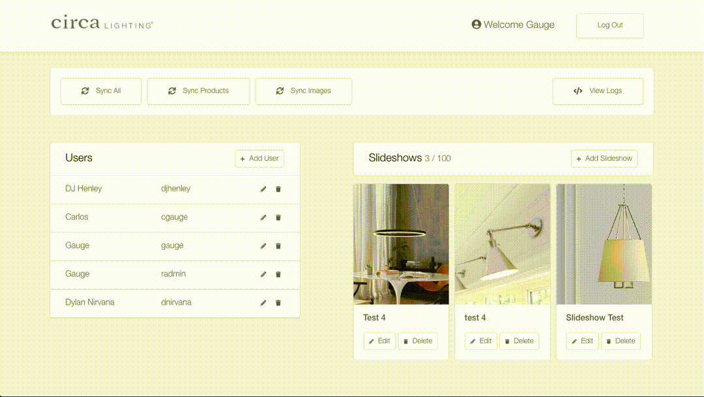
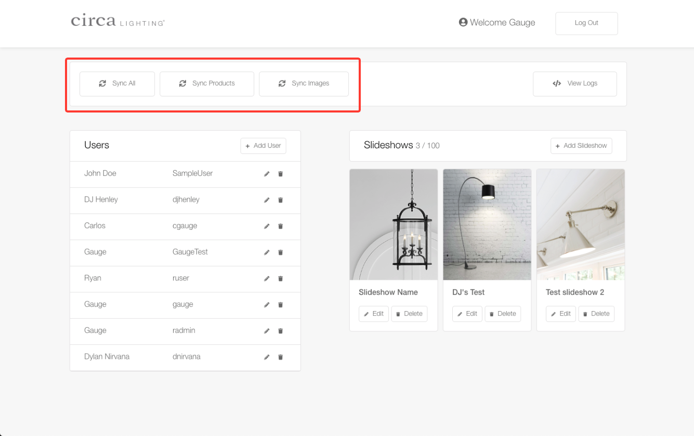
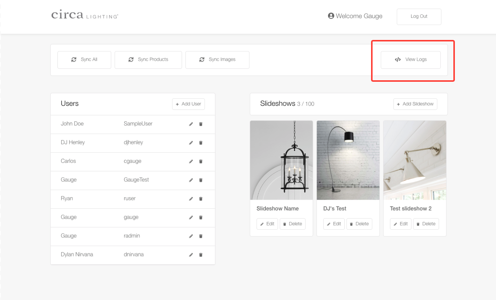

# Global Admin

This is the global admin where admin users can edit slideshows and other users.

`Global Path` - http://global.circascreens.com/auth/login

## Logging In

Path - `/auth/login`

**Note:** *Please contact an admin to change your password.*

## Create User

Path - `http://global.circascreens.com/admin/dashboard`

This will allow you to create ocal and admin users. To update a user role to admin, check the box under passwors like shown below.

## Edit User

Path - `http://global.circascreens.com/admin/dashboard`

This will allow you to edit users name, username, or password. To update a user role to Admin, please contact administrator. All fields are optional when updating, and will remain the same if untouched.

## Delete User

Path - `http://global.circascreens.com/admin/dashboard`

This will allow you to delete a user. If you have any trouble, please contact an admin.

## Create Slideshow

Path - `http://global.circascreens.com/slideshows/create`

This will allow you to create slideshows. Drag images in or click on rectangle to upload files.

**Image recommendations:**
* 4k Resolution
* Portrait Mode
* JPEG, JPG, PNG

## Edit Slideshow

Path - `http://global.circascreens.com//slideshows/edit`

This will allow you to edit slideshow images and title. See image recommendations above.

## Delete Slideshow

Path - `http://global.circascreens.com/admin/dashboard`

This will allow you to delete a slideshow. You will not be able to retrive deleted slideshows. Proceed with coution.

## Syncing Data

The app automatically pull the latest product and image data from the feed every day at 9pm EST.

The actions bar is located in all admin pages. You can sync products, images, or everything. **Note that it should be rare that this button is ever used or needed.**

Path - `/admin/dashboard`

## Logs

Path - `/admin/logs`

By clicking on the `View Logs` button you can see the logs for previously ran process's like syncing of products/images.

