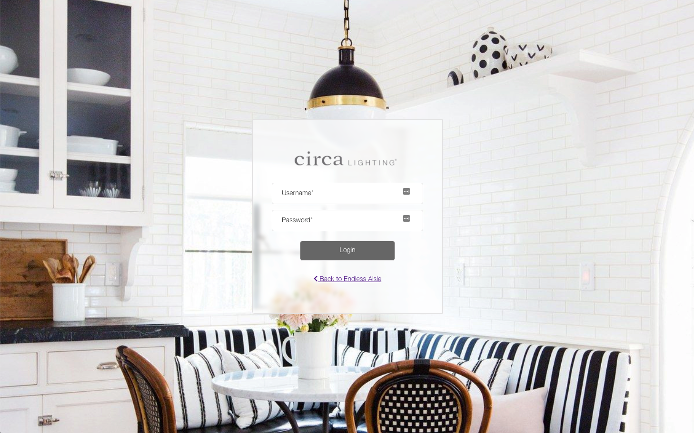
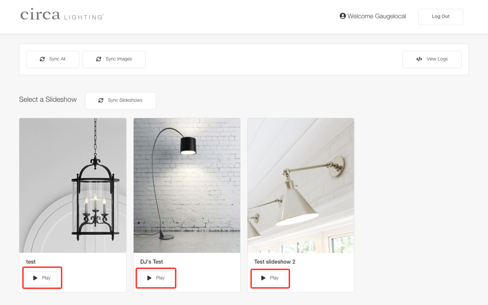
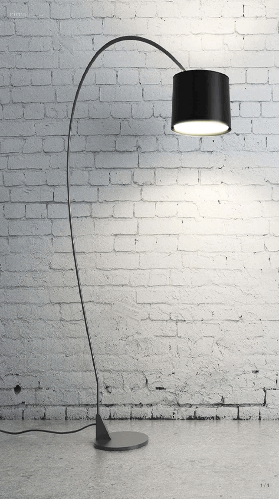
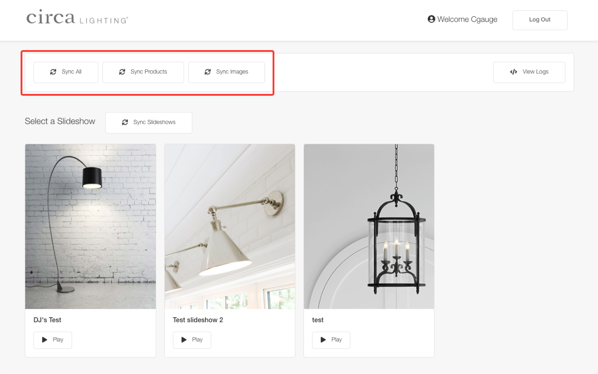
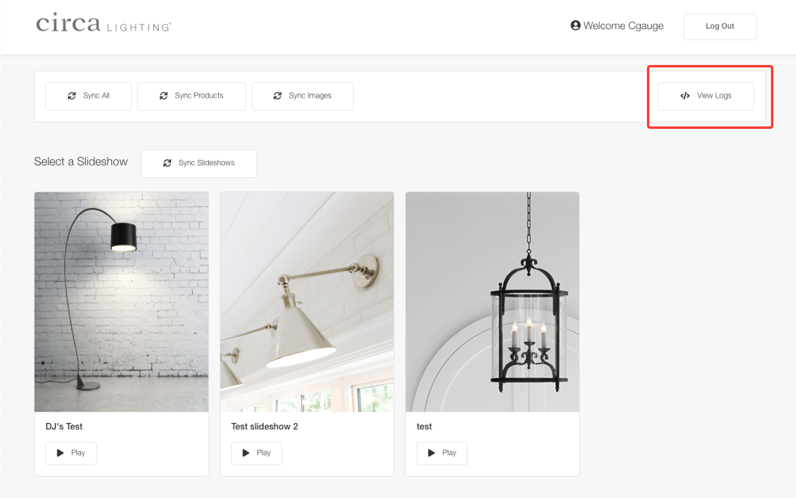

# Local Screens

This is the local application where staff members can play a slideshow, or sync data. Users can search the catalog and see life scale images of their favorite products. App is intended to be used on portrait screens only.

`Local Path` - http://192.168.99.100/

`Local Admin Path` - http://192.168.99.100/auth/login

Global urls should only be used when accessing the application outside the mounted screens (Intended for iPad use only)

`Global Path` - http://circascreens.com/

`Global Admin Path` - http://circascreens.com/auth/login

**Note:** *The docker machine & images must be running for local urls to run properly.*

To restart Docker machine & images, you have two options:

**Via Docker Quick Start Terminal**:
```
docker-machine stop
docker-machine start
```

## Dimension Settings

To scale product images properly visit the corresponding url. This will tell the app what screen size you are in **(55 Inch or 98 Inch)**, and save it for future use.

**Note:** *If product scale seems off, the browser might have forgotten the stored screen size setting. Visit the corresponding url to reset the screen size setting.*

`55 Inch Screen` - http://192.168.99.100/collections?screen=55

`98 Inch Screen` -  http://192.168.99.100/collections?screen=98


## Logging In

Path - `/auth/login`




## Play Slideshow

To play a slideshow, visit the url below, and click on "Play" button.

Path - `http://192.168.99.100/admin/slideshows`



## Exit Slideshow

To exit a slideshow, you have two options. 

**Go to Admin -** Click on Circa Lighting logo that is on top left of the screen, and `Go to Admin` will appear.

**Go to Products -** Click on bottom half of the screem, and `Got to Products` will appear.




## Syncing Data

The local screen’s automatically pull the latest product data from the master server every morning at 6:45am EST. However, there is a button that allows you to manually sync the data at any time. **Note that it should be rare that this button is ever used or needed.**

Path - `/admin`

The actions bar is located in all admin pages. You sync products, images, or everything.




## Logs

On the logs page you can see the logs for previously ran process's like syncing of products/images.

Path - `/admin/logs`




