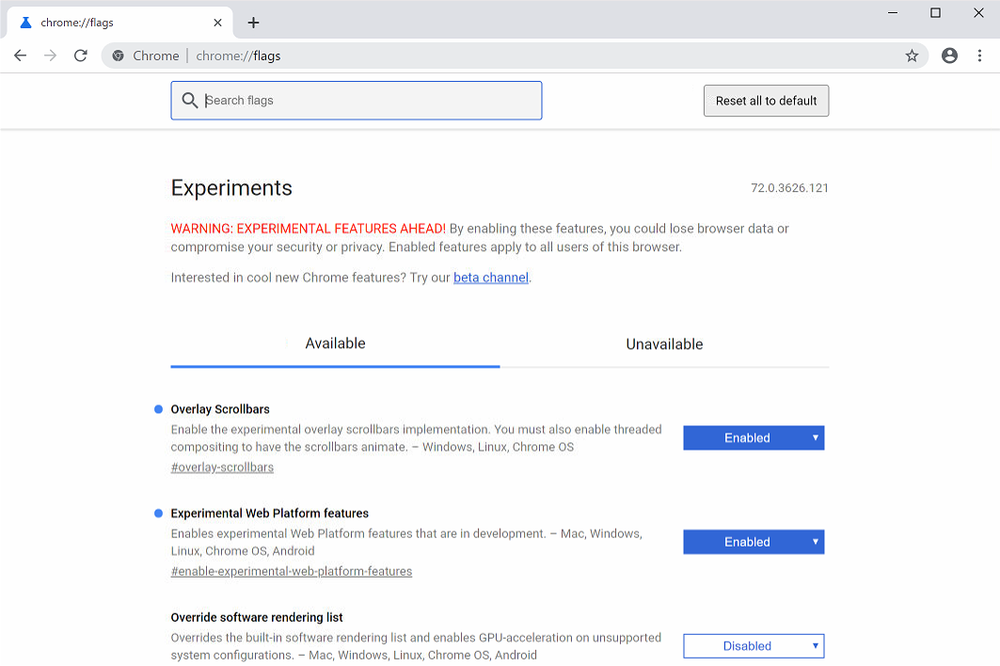
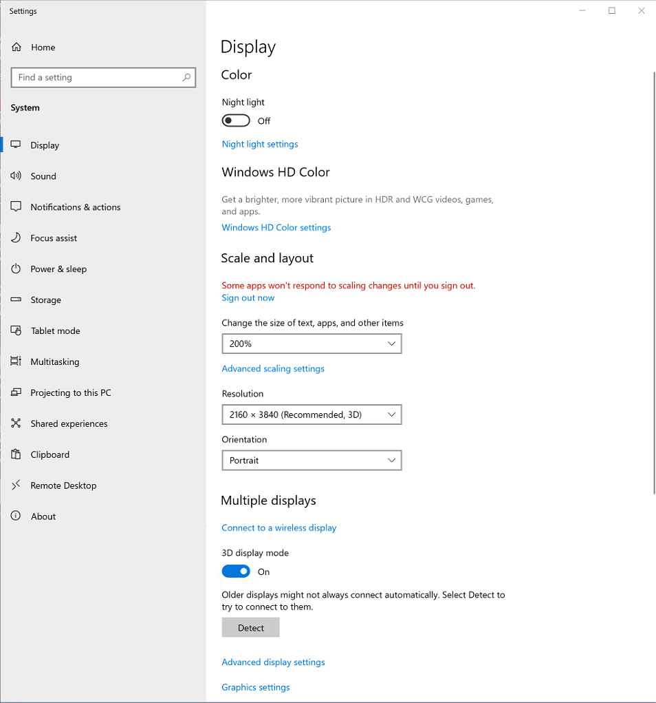

# Recommended Settings

These are the recommended settings so that the Circa Screens Node App runs as smoothly as possible.

## Chrome Settings

All instructions below are for Chrome browser. These will help insure that the app runs as intended.

#### Enable Features

Path - `chrome://flags`

Enable Both:
* Experimental Web Platform features
* Overlay Scrollbars

___

#### Enable Cache

1. Select the “Menu” button in the upper-right corner, then select “More tools” > “Developer tools“. You can also get to this screen by pressing Ctrl + Shift + I for Windows and Linux or Command + Option + I for Mac OS X.
2. The Dev Tools window appears. Select “Network“,
3. Confirm that the “Disable cache” box is **NOT** checked.

## Windows Settings

All instructions below are for Windows OS. These will help insure that the app runs as intended.

#### Display Settings

Go to your Desktop, right-click your mouse and go to Display Settings. If on tablet mode, click on gear icon on bottom left of screen. Then search for display settings. Your settings should be as followed.

* `Change the size of text, apps, and other items` - 200%
* `Resolution` - 2160 x 3840
* `Orientation` - Portrait

#### Tablet Mode (55 Inch Only)

Tablet mode makes Windows 10 more touch-friendly when using your touch screen device. To enable select the action center on the taskbar (on the right side of the date and time), and then select Tablet mode to turn it on or off.

*Tablet mode should only be activated on 55 inch touch screen*

